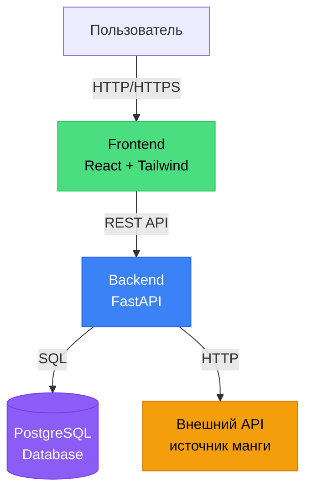
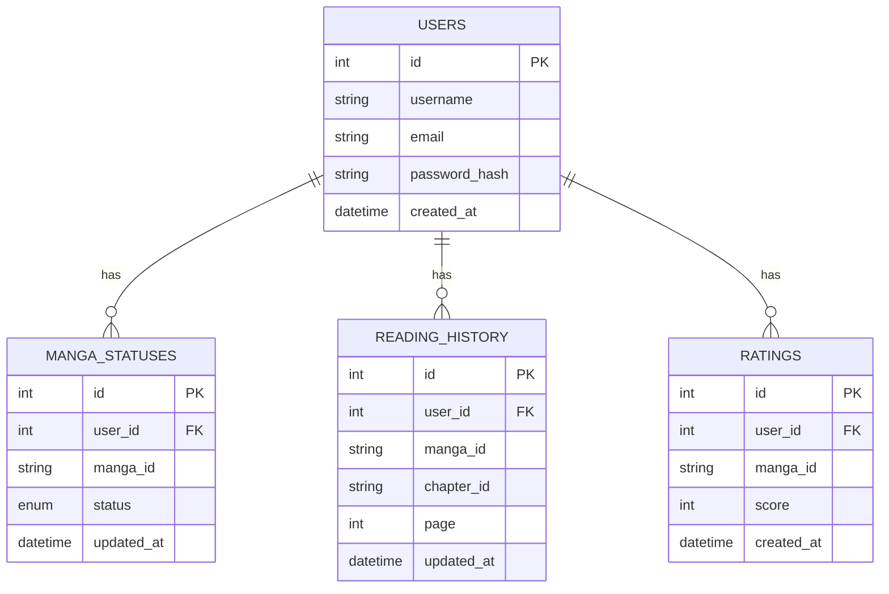

```mermaid
graph TB
    User[Пользователь] -->|HTTP/HTTPS| Frontend[Frontend<br/>React + Tailwind]
    Frontend -->|REST API| Backend[Backend<br/>FastAPI]
    Backend -->|SQL| DB[(PostgreSQL<br/>Database)]
    Backend -->|HTTP| External[Внешний API<br/>источник манги]
    
    style Frontend fill:#4ade80,stroke:#22c55e,color:#000
    style Backend fill:#3b82f6,stroke:#2563eb,color:#fff
    style DB fill:#8b5cf6,stroke:#7c3aed,color:#fff
    style External fill:#f59e0b,stroke:#d97706,color:#000
```

```mermaid
erDiagram
    USERS ||--o{ MANGA_STATUSES : has
    USERS ||--o{ READING_HISTORY : has
    USERS ||--o{ RATINGS : has
    
    USERS {
        int id PK
        string username
        string email
        string password_hash
        datetime created_at
    }
    
    MANGA_STATUSES {
        int id PK
        int user_id FK
        string manga_id
        enum status
        datetime updated_at
    }
    
    READING_HISTORY {
        int id PK
        int user_id FK
        string manga_id
        string chapter_id
        int page
        datetime updated_at
    }
    
    RATINGS {
        int id PK
        int user_id FK
        string manga_id
        int score
        datetime created_at
    }
```